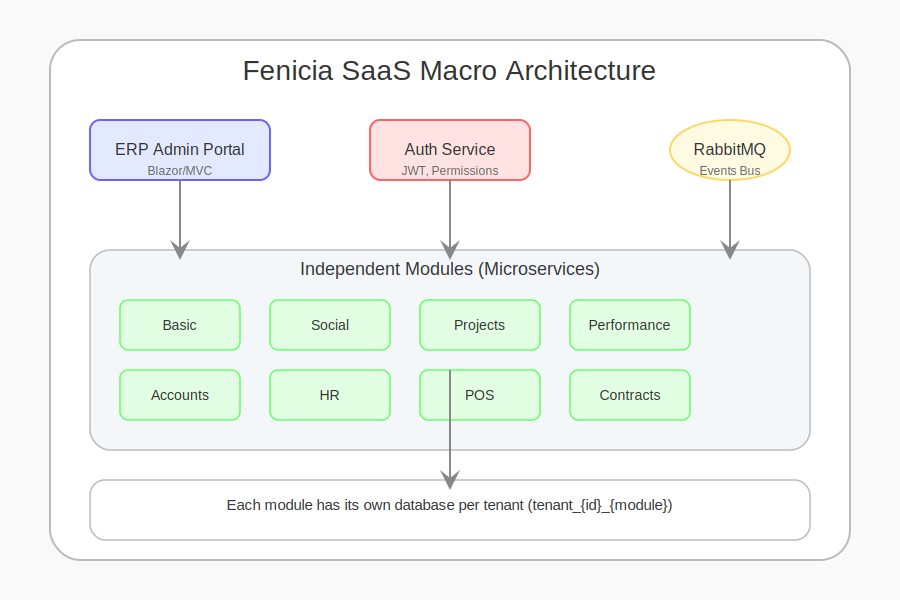

# Fenicia Documentation

Welcome to the Fenicia documentation! Here you'll find guides, architecture diagrams, and usage examples.

## Table of Contents
- [Quickstart](quickstart.md)
- [Architecture](architecture.md)
- [Modules](modules.md)
- [API Reference](api.md)

---

## 1️⃣ Macro System Overview

Fenicia is a modular, multi-tenant SaaS platform designed for administrative ERP, client management, subscriptions, payments, billing, and permissions. It features:

- **Central Auth Service**: Manages login, JWT, permissions, tenantId, and active modules.
- **Independent Modules**: Each module is a REST microservice with its own database per tenant (`tenant_{id}_{module}`), communicating via RabbitMQ events and authorized by JWT.
- **ERP Admin Portal**: Centralizes SaaS management (clients, billing, permissions, etc.).

---

## Project Overview
Fenicia is a modular, multi-tenant SaaS platform built with .NET and Next.js. It is designed for scalability, security, and rapid development.

---

## Contributing to Docs
Feel free to improve these docs by submitting a pull request!
